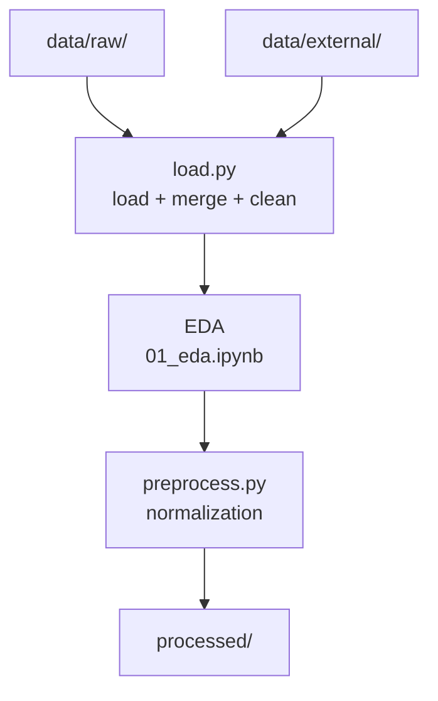

# Data Pipeline

## Overview

The project uses multiple data sources that are normalized to a unified format,
merged, cleaned.

## Sources

| Source | Path | Description |
|---|---|---|
| Downloaded datasets | `data/raw/` | HF, Kaggle |
| Manual labeling | `data/external/` | 500 examples (WIP) |
| Processed | `data/processed/` | Ready splits |

## Data format

All datasets are normalized to a unified format:

| Column | Type | Description |
|---|---|---|
| `text` | str | Message text |
| `label` | int | 0 = not toxic, 1 = toxic |




## Steps

### 1. Loading
`training/dataset/load.py` — loads all sources, normalizes to `text, label` format, merges them.

```python
from training.dataset.load import load_all_data
df = load_all_data()
```

### 2. EDA
`notebooks/01_eda.ipynb` — exploratory analysis: class balance, text length, examples.

### 3. Preprocessing
`training/dataset/preprocess.py` — text normalization (lowercase, URLs, emojis), deduplication.


## Notes

- **Test set** — held out in advance, not touched until final evaluation
- **Reproducibility** — `processed/` is always regenerated from `raw/` + `external/`
- **Privacy** — `data/external/` is anonymized before committing
